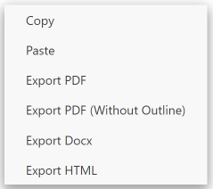

# Office Viewer

## 介绍

功能:

- 集成了一个图标主题和颜色主题.
- 支持预览xlsx, docx, svg, pdf, zip等办公文件格式.
- 集成[Vditor](https://github.com/Vanessa219/vditor)实现对markdown的所见即所得编辑(对代码块支持较差).

## Markdown

编辑器使用说明: [禁用方式看这里](https://github.com/cweijan/vscode-office?tab=readme-ov-file#markdown)

- 编辑方式: 直接通过vscode打开md文件.
- 可通过工具栏按钮打开VSCode内置编辑器.
  
- 在编辑器打开右键菜单可将markdown导出为pdf, docx或者html, pdf依赖于chromium, 可通过 `vscode-office.chromiumPath`配置chromium浏览器路径.
  

快捷键: 基于[Vditor快捷键](shortcut.md)以及更多:

- 将列表上移一行: `Ctrl Alt I` / `⌘ ^ I`
- 将列表下移一行: `Ctrl Alt J` / `⌘ ^ J`
- 在VS Code中编辑: `Ctrl Alt E` / `⌘ ^ E`

## 其他功能

- 图标主题: 内置了Material Icon Theme部分icon
- Excel: 支持对xlsx, csv等excel文件进行预览和保存(注意xlsx保存会丢失格式, csv则不支持gbk中文)
- HTML: 编辑HTML的过程中按下ctrl+shift+v可实时预览.
- PDF: 支持直接预览pdf文件
- HTTP: 用于发送http请求, 由于REST Client本地请求有bug, 修改后进行集成.

## Sponsor

适用于VS Code的数据库客户端, 支持**MySQL/MariaDB, PostgreSQL, SQLite, Redis**以及**ElasticSearch**, 且可作为一个SSH客户端, 最大程度地提高你的生产力! [立刻安装](https://marketplace.visualstudio.com/items?itemName=cweijan.vscode-database-client2).

## Credits

- PDF rendering: [mozilla/pdf.js/](https://github.com/mozilla/pdf.js/)
- Docx rendering: [VolodymyrBaydalka/docxjs](https://github.com/VolodymyrBaydalka/docxjs)
- XLSX rendering:
  - [SheetJS/sheetjs](https://github.com/SheetJS/sheetjs): XLSX parsing
  - [myliang/x-spreadsheet](https://github.com/myliang/x-spreadsheet): XLSX rendering
- HTTP: [Rest  Client](https://github.com/Huachao/vscode-restclient)
- Markdown: [Vanessa219/vditor](https://github.com/Vanessa219/vditor)
- Material Icon theme: [PKief/vscode-material-icon-theme](https://github.com/PKief/vscode-material-icon-theme)
