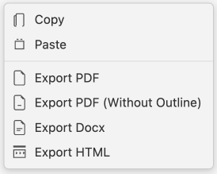

# Office Viewer

[English](README.md) | 简体中文 | [繁體中文](README-TW.md)

## 介绍

本扩展支持在 VS Code 中预览以下常见的办公文件格式：

- Excel: `.xls`、`.xlsx`、`.xlsm`、`.csv`、`.ods`
- Word: `.docx`、`.dotx`
- PowerPoint: `.pptx`、`.pptm`
- PDF 与电子书: `.pdf`、`.epub`
- HEIC/TIFF: `.heic`、`.heif`、`.tiff`
- 设计文件: `.psd`、`.xmind`、`.icns`、`.svg`
- 字体: `.ttf`、`.otf`、`.woff`、`.woff2`
- Markdown: `.md`、`.markdown`
- HTML: `.html`、`.htm`
- HTTP 请求: `.http`、`.rest`
- Windows 注册表: `.reg`
- Java: `.class`（反编译）
- 压缩文件: `.zip`、`.jar`、`.vsix`、`.rar`、`.7z`、`.tar`、`.tar.gz`、`.tgz`、`.apk`

## Markdown

集成 [Vditor](https://github.com/Vanessa219/vditor) 实现 Markdown 所见即所得编辑。

如需使用 VS Code 原生 Markdown 编辑器，请在 `settings.json` 中添加以下配置：

```json
{
    "workbench.editorAssociations": {
        "*.md": "default",
        "*.markdown": "default"
    }
}
```

在编辑器中右键，可将 Markdown 导出为 PDF、DOCX 或 HTML。PDF 导出依赖 Chromium，可通过 `vscode-office.chromiumPath` 配置浏览器路径。



快捷键：基于 [Vditor 快捷键](shortcut.md)，以及：

- 将列表上移一行: `Ctrl Alt I` / `⌘ ^ I`
- 将列表下移一行: `Ctrl Alt J` / `⌘ ^ J`
- 在 VS Code 中编辑: `Ctrl Alt E` / `⌘ ^ E`

提示：

- 可通过 Ctrl/Cmd + 鼠标滚轮调整编辑器大小。
- 按住 Ctrl/Meta + 单击或双击可打开超链接。

## 其他功能

- HTML: 编辑时按下 `Ctrl+Shift+V` 可实时预览
- Git 历史: 在源代码管理视图或文件右键菜单中浏览提交图、查看文件历史、对比修订并执行常用 Git 操作
- YAML: 支持文档大纲与锚点导航（别名引用可跳转到定义）
- 图标主题: 内置 [Material Icon Theme](https://github.com/PKief/vscode-material-icon-theme) 部分图标，并提供 **Office Material Icon Theme** 与 **One Dark Modern** 配色主题
- Excel: 支持预览和保存 `.xlsx`、`.xls`、`.xlsm`、`.csv`、`.ods` 等文件（注意保存 `.xlsx` 可能丢失格式；`.csv` 不支持 GBK 编码的中文）
- HTTP: 在 `.http`、`.rest` 文件中发送请求（集成自 [REST Client](https://github.com/Huachao/vscode-restclient)，并修复了本地请求的已知问题）；按 `Ctrl+Enter` / `⌘ Enter` 发送
- Java: 打开 `.class` 文件可反编译并查看源码

## Sponsor

[](https://marketplace.visualstudio.com/items?itemName=cweijan.vscode-database-client2)

适用于 Visual Studio Code 的数据库客户端，支持 **MySQL/MariaDB、PostgreSQL、SQLite、Redis** 以及 **ElasticSearch** 等数据库的管理，且可作为一个 SSH 客户端，极大地提升您的生产力！[立刻安装](https://marketplace.visualstudio.com/items?itemName=cweijan.vscode-database-client2)。

## 使用数据（Usage Data）

Office Viewer 会收集**匿名使用数据**，用于了解各预览功能的使用情况，以便改进扩展。数据通过官方模块 [`@vscode/extension-telemetry`](https://www.npmjs.com/package/@vscode/extension-telemetry) 发送至 [Azure Application Insights](https://learn.microsoft.com/zh-cn/azure/azure-monitor/app/app-insights-overview)。

### 收集内容

| 事件 | 触发时机 | 属性 |
|------|---------|------|
| `view.open` | 打开自定义预览/编辑器 | `viewType`（如 `excel`、`markdown`、`pdf`）、`fileType`（仅扩展名，如 `xlsx`、`md`） |
| `gitHistory.view` | 打开 Git 历史视图 | `mode`：`repo`（仓库历史）或 `file`（单文件历史） |

**不会**收集文件路径、文件名、URL、仓库名、请求内容或其他可识别个人身份的信息。

### 如何关闭

仅在以下**两项均允许**时才会上报：

1. VS Code 全局遥测已开启（`telemetry.telemetryLevel` 不为 `off`，或旧版中 `telemetry.enableTelemetry` 为 `true`）。
2. 扩展遥测已开启：在设置中将 `vscode-office.enableTelemetry` 设为 `false` 可单独关闭本扩展的上报。

也可在 **设置 → 应用程序 → 遥测** 中关闭 VS Code 的全部遥测。

### 维护者配置

若自行构建并发布本扩展，请参阅 [docs/telemetry.md](docs/telemetry.md) 配置 Azure Application Insights 及示例查询。

## Credits

- PDF rendering: [mozilla/pdf.js](https://github.com/mozilla/pdf.js/)
- DOCX rendering: [VolodymyrBaydalka/docxjs](https://github.com/VolodymyrBaydalka/docxjs)
- PPTX rendering: [pptxviewjs](https://www.npmjs.com/package/pptxviewjs)
- XLSX rendering:
  - [SheetJS/sheetjs](https://github.com/SheetJS/sheetjs): XLSX parsing
  - [myliang/x-spreadsheet](https://github.com/myliang/x-spreadsheet): XLSX rendering
- EPUB: [futurepress/epub.js](https://github.com/futurepress/epub.js)
- PSD: [ag-psd](https://github.com/Agamnentzar/ag-psd)
- XMind: [mind-elixir](https://github.com/ssshooter/mind-elixir-core), [@mind-elixir/import-xmind](https://github.com/ssshooter/mind-elixir-core)
- HEIC conversion: [heic2any](https://github.com/alexcorvi/heic2any)
- Java decompiler: [JetBrains/java-decompiler](https://github.com/JetBrains/intellij-community/tree/master/plugins/java-decompiler/engine)
- HTTP: [REST Client](https://github.com/Huachao/vscode-restclient)
- Markdown: [Vanessa219/vditor](https://github.com/Vanessa219/vditor)
- Material Icon theme: [PKief/vscode-material-icon-theme](https://github.com/PKief/vscode-material-icon-theme)
