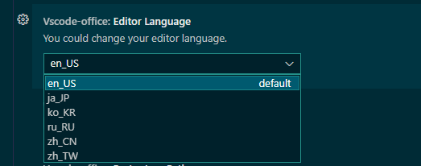

# vscode-office

[中文说明](README-CN.md)

This extension supports previewing these common office file formats.

- Excel: .xls, .xlsx, .csv
- Svg: .svg
- Pdf: .pdf
- Font: .ttf, .otf, .woff
- Markdown: .md
- HttpRequest: .http
- Windows Reg: .reg

If it helps you, consider star this repository (●'◡'●).

## Markdown

This extension changes the default markdown editor to the excellent vditor:

- A WYSIWYG editor for markdown.
- Which provides export to pdf (via right click in the document tab).

If you want to use the original vscode editor, insert this in your `settings.json`.

```json
{
    "workbench.editorAssociations": {
        "*.md": "default"
    }
}
```

Markdown editor default languge is English. If you want change it, could change in VSCode settings. It support the following languages,
 en_US, ja_JP, ko_KR, ru_RU, zh_CN, zh_TW.



## HTML

The html editor supports live viewing.   Press ctrl+shift+v to open the live view.
