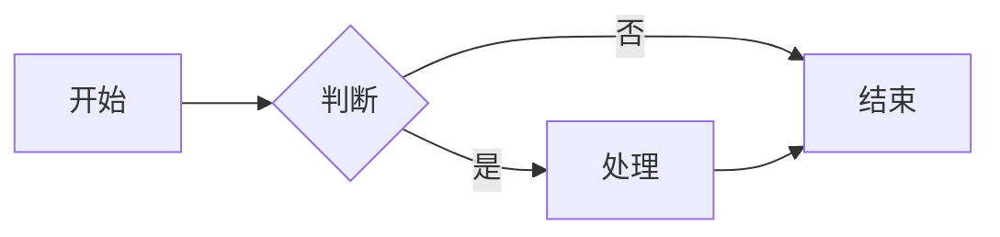
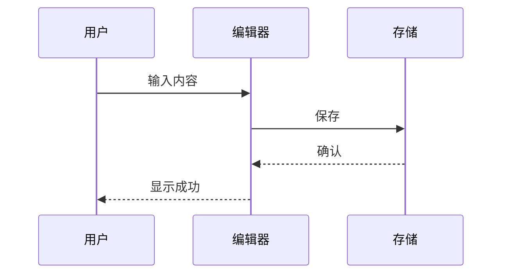
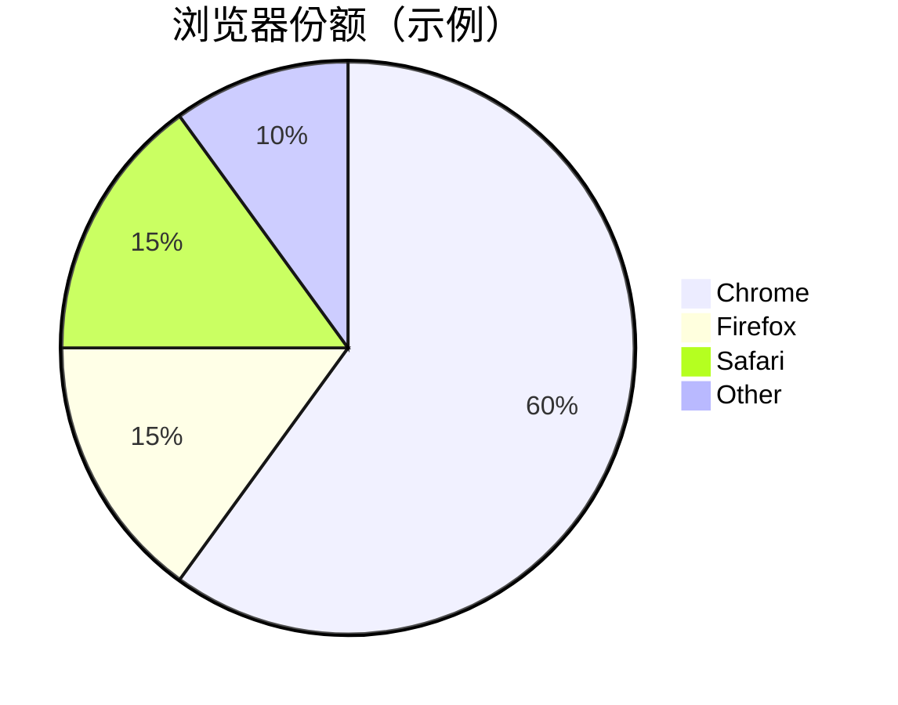

# 一级标题 H1

用于测试标题换行、段落间距、光标定位等基础编辑行为。

## 二级标题 H2

### 三级标题 H3

#### 四级标题 H4

##### 五级标题 H5

###### 六级标题 H6

[ToC]

---

## 1. 段落与换行

这是第一段普通段落。用于测试段落排版、行高和上下间距。

这是第二段。中间用空行分隔，应显示为两个独立段落。

这是同一段内的软换行（行尾两个空格）  
下一行仍属于同一段落。

---

## 2. 行内样式

- **加粗** `**bold**`
- *斜体* `*italic*`
- ***加粗斜体*** `***bold italic***`
- ~~删除线~~ `~~strike~~`
- `行内代码` `` `code` ``
- ==高亮标记==（若渲染器支持）
- 上标 x^2^、下标 H~2~O（若渲染器支持）
- 键盘按键 <kbd>Ctrl</kbd> + <kbd>S</kbd>

混合样式：**加粗中有 *斜体* 和 `代码`**。

---

## 3. 链接

- 行内链接：[Vditor 官网](https://b3log.org/vditor)
- 带标题链接：[GitHub](https://github.com "GitHub 首页")
- 邮箱链接：[test@example.com](mailto:test@example.com)
- 自动链接：<https://example.com>
- 引用式链接：[引用链接文本][ref-link]

[ref-link]: https://example.com/reference

---

## 4. 图片


---

## 5. 列表

### 无序列表

- 苹果
- 香蕉
  - 进口香蕉
  - 国产香蕉
- 橙子

### 有序列表

1. 第一步
2. 第二步
   1. 子步骤 A
   2. 子步骤 B
3. 第三步

### 任务列表

- [x] 已完成任务
- [x] 另一个已完成
- [ ] 未完成任务
- [ ] 待测试：标题换行后空行是否为纯文本

---

## 6. 引用

> 这是一段引用。
>
> 引用中可以包含 **加粗**、`代码` 和 [链接](https://example.com)。

> 嵌套引用示例：
>
> > 第二层引用
> >
> > > 第三层引用

---

## 7. 代码块

### 普通代码块

```
plain text code block
no syntax highlight
```

### JavaScript

```javascript
function greet(name) {
  const msg = `Hello, ${name}!`;
  console.log(msg);
  return msg;
}

greet("Vditor");
```

### TypeScript

```typescript
interface User {
  id: number;
  name: string;
}

const user: User = { id: 1, name: "test" };
```

### Python

```python
def fib(n: int) -> list[int]:
    a, b = 0, 1
    result = []
    for _ in range(n):
        result.append(a)
        a, b = b, a + b
    return result

print(fib(8))
```

### JSON

```json
{
  "name": "vditor",
  "version": "4.0.0",
  "features": ["wysiwyg", "ir", "sv"]
}
```

### Shell

```bash
#!/bin/bash
echo "Hello World"
ls -la
```

---

## 8. 表格

| 左对齐 | 居中对齐 | 右对齐 | 默认 |
| :----- | :------: | -----: | ---- |
| A1     | B1       | C1     | D1   |
| 较长文本单元格 | 42 | 3.14 | ok |
| `code` | **bold** | *italic* | [link](https://example.com) |

| 姓名 | 年龄 | 城市 |
| ---- | ---- | ---- |
| 张三 | 28   | 北京 |
| 李四 | 32   | 上海 |

---

## 9. 分割线

上文

---

下文

***

另一种分割线

---

## 10. 折叠块

<details>
<summary>点击展开摘要</summary>

这里是折叠内容，可包含：

- 列表项
- **样式文本**
- `代码`

</details>

---

## 11. 数学公式

行内公式：$a^2 + b^2 = c^2$，以及 $\sum_{i=1}^{n} i = \frac{n(n+1)}{2}$。

块级公式：

$$
\int_{-\infty}^{\infty} e^{-x^2}\, dx = \sqrt{\pi}
$$

矩阵示例：

$$
\begin{bmatrix}
1 & 2 \\
3 & 4
\end{bmatrix}
\begin{bmatrix}
x \\
y
\end{bmatrix}
=
\begin{bmatrix}
5 \\
11
\end{bmatrix}
$$

---

## 12. Mermaid 图表

### 流程图



### 时序图



### 甘特图


### 饼图



---

## 13. 脚注

正文中的脚注引用[^fn1]，以及第二条脚注[^fn2]。

[^fn1]: 第一个脚注定义，支持 **加粗** 和 `代码`。
[^fn2]: 第二个脚注可以写多行内容。

    缩进段落也属于该脚注定义。

---

## 14. 表情与特殊字符

Emoji：😀 😎 🎉 ✅ ❌ ⚠️ 💡 🚀

特殊字符：`&lt;tag&gt;`、`&amp;`、`&copy;`、&copy;、&trade;

---

## 15. 混合嵌套（压力测试）

> #### 引用中的标题
>
> 1. 有序列表第一项
>    - 嵌套无序项
>    - [x] 嵌套任务项
> 2. 第二项
>
> ```js
> // 引用中的代码
> console.log("nested");
> ```
>
> | 表头 | 值 |
> | ---- | -- |
> | key  | 42 |

---

## 16. 编辑行为测试清单

在 WYSIWYG 模式下可逐项验证：

| 测试项 | 操作 | 期望结果 |
| ------ | ---- | -------- |
| 标题换行 | 在标题行按 Enter | 新行变为普通段落，非标题样式 |
| 空行间距 | 标题下生成空段落 | 与上方标题有正常垂直间距 |
| 标题降级 | 空标题按 Backspace | 恢复为普通段落 |
| 任务勾选 | 点击 checkbox | 状态切换并正确导出 |
| 代码高亮 | 切换代码块语言 | 语法高亮正确 |
| 公式渲染 | 输入 `$...$` 或 `$$...$$` | 公式正确显示 |
| 撤销重做 | ⌘Z / ⌘Y | 历史记录正常 |

---

## 附录：原始 Markdown 片段

```markdown
# 标题
**bold** *italic* ~~strike~~
- list
> quote
| table | head |
| ----- | ---- |
```

*文档结束 — 可用于 Vditor / Markdown 编辑器全功能回归测试。*
