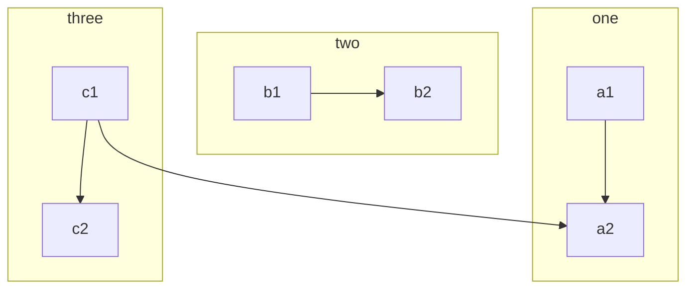
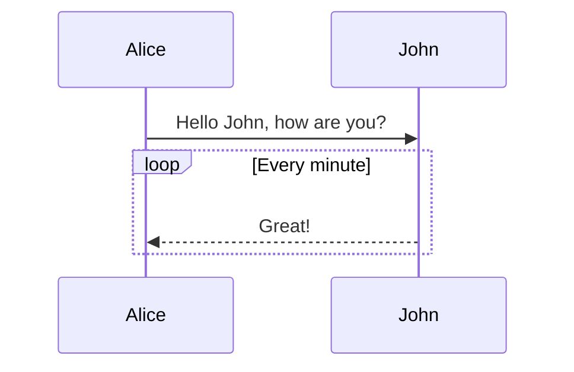
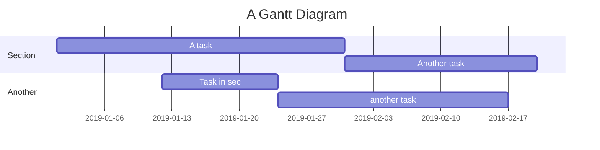

Vditor 是一款**所见即所得**编辑器，支持 *Markdown*。

* 不熟悉 Markdown 可使用工具栏或快捷键进行排版
* 熟悉 Markdown 可直接排版

更多细节和用法请参考 [Vditor - 浏览器端的 Markdown 编辑器](https://ld246.com/article/1549638745630)，同时也欢迎向我们提出建议或报告问题，谢谢 ❤️

## 教程

这是一篇讲解如何正确使用 **Markdown** 的排版示例，学会这个很有必要，能让你的文章有更佳清晰的排版。

> 引用文本：Markdown is a text formatting syntax inspired

## 语法指导

### 普通内容

这段内容展示了在内容里面一些排版格式，比如：

- **加粗** - `**加粗**`
- *倾斜* - `*倾斜*`
- ~~删除线~~ - `~~删除线~~`
- `Code 标记` - `` `Code 标记` ``
- [超级链接](https://ld246.com) - `[超级链接](https://ld246.com)`
- [username@gmail.com](mailto:username@gmail.com) - `[username@gmail.com](mailto:username@gmail.com)`

### 提及用户

@Vanessa 通过 `@User` 可以在内容中提及用户，被提及的用户将会收到系统通知。

> NOTE:
>
> 1. @用户名之后需要有一个空格
> 2. 新手没有艾特的功能权限

### 表情符号 Emoji

支持大部分标准的表情符号，可使用输入法直接输入，也可手动输入字符格式。通过输入 `:` 触发自动完成，可在个人设置中[设置常用表情](https://ld246.com/settings/function)。

#### 一些表情例子

😄 😆 😵 😭 😰 😅  😢 😤 😍 😌
👍 👎 💯 👏 🔔 🎁 ❓ 💣 ❤️ ☕️ 🌀 🙇 💋 🙏 💢

### 大标题 - Heading 3

你可以选择使用 H1 至 H6，使用 ##(N) 打头。建议帖子或回帖中的顶级标题使用 Heading 3，不要使用 1 或 2，因为 1 是系统站点级，2 是帖子标题级。

> NOTE: 别忘了 # 后面需要有空格！

#### Heading 4

##### Heading 5

###### Heading 6

### 图片

```


```

支持复制粘贴直接上传。

### 代码块

#### 普通

```
*emphasize*    **strong**
_emphasize_    __strong__
var a = 1
```

#### 语法高亮支持

如果在 ``` 后面跟随语言名称，可以有语法高亮的效果哦，比如:

##### 演示 Go 代码高亮

```go
package main

import "fmt"

func main() {
	fmt.Println("Hello, 世界")
}
```

##### 演示 Java 高亮

```java
public class HelloWorld {

    public static void main(String[] args) {
        System.out.println("Hello World!");
    }

}
```

> Tip: 语言名称支持下面这些: `ruby`, `python`, `js`, `html`, `erb`, `css`, `coffee`, `bash`, `json`, `yml`, `xml` ...

### 有序、无序、任务列表

#### 无序列表

- Java
  - Spring
    - IoC
    - AOP
- Go
  - gofmt
  - Wide
- Node.js
  - Koa
  - Express

#### 有序列表

1. Node.js
   1. Express
   2. Koa
   3. Sails
2. Go
   1. gofmt
   2. Wide
3. Java
   1. Latke
   2. IDEA

#### 任务列表

- [X] 发布 Sym
- [X] 发布 Solo
- [ ] 预约牙医

### 表格

如果需要展示数据什么的，可以选择使用表格。

| header 1 | header 2 |
| -------- | -------- |
| cell 1   | cell 2   |
| cell 3   | cell 4   |
| cell 5   | cell 6   |

### 隐藏细节

<details>
<summary>这里是摘要部分。</summary>
这里是细节部分。
</details>

### 段落

空行可以将内容进行分段，便于阅读。（这是第一段）

使用空行在 Markdown 排版中相当重要。（这是第二段）

### 链接引用

[链接文本][链接标识]

[链接标识]: https://b3log.org
```
[链接文本][链接标识]

[链接标识]: https://b3log.org
```

### 数学公式

多行公式块：

$$
\frac{1}{
  \Bigl(\sqrt{\phi \sqrt{5}}-\phi\Bigr) e^{
  \frac25 \pi}} = 1+\frac{e^{-2\pi}} {1+\frac{e^{-4\pi}} {
    1+\frac{e^{-6\pi}}
    {1+\frac{e^{-8\pi}}{1+\cdots}}
  }
}
$$

行内公式：

公式 $a^2 + b^2 = \color{red}c^2$ 是行内。

### 流程图



### 时序图



### 甘特图



### 多媒体

支持 v.qq.com，youtube.com，youku.com，coub.com，facebook.com/video，dailymotion.com，.mp4，.m4v，.ogg，.ogv，.webm，.mp3，.wav 链接解析

https://v.qq.com/x/cover/zf2z0xpqcculhcz/y0016tj0qvh.html

### 脚注

这里是一个脚注引用[^1]，这里是另一个脚注引用[^bignote]。

[^1]: 第一个脚注定义。
    
[^bignote]: 脚注定义可使用多段内容。
    
       缩进对齐的段落包含在这个脚注定义内。
    
       ```
       可以使用代码块。
       ```
       还有其他行级排版语法，比如**加粗**和[链接](https://b3log.org)。
    
```
这里是一个脚注引用[^1]，这里是另一个脚注引用[^bignote]。
[^1]: 第一个脚注定义。
[^bignote]: 脚注定义可使用多段内容。

    缩进对齐的段落包含在这个脚注定义内。

    ```
    可以使用代码块。
    ```

    还有其他行级排版语法，比如**加粗**和[链接](https://b3log.org)。
```

## 快捷键

我们的编辑器支持很多快捷键，具体请参考 [键盘快捷键](https://ld246.com/article/1474030007391)（或者按 "`?` "😼）
